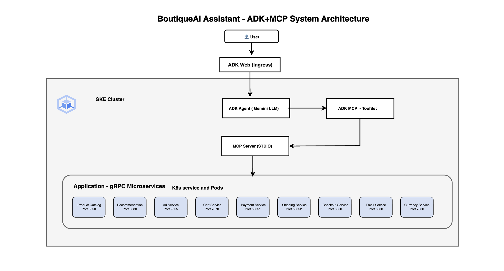
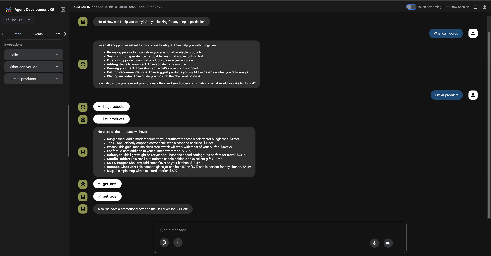
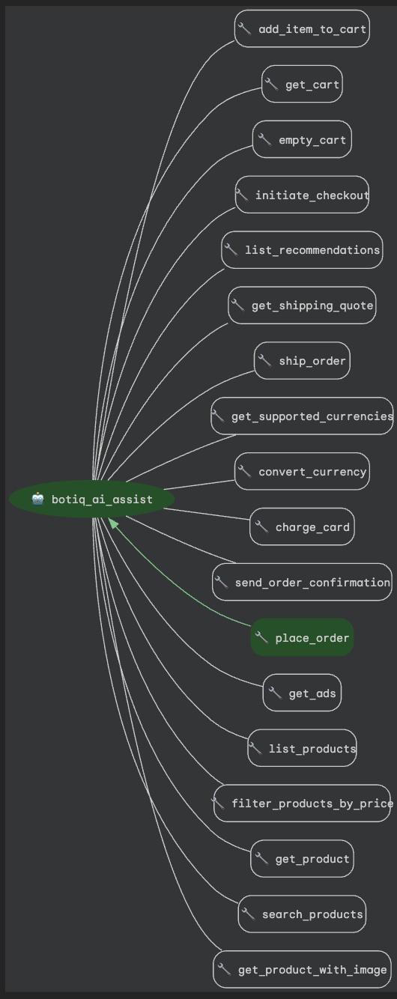
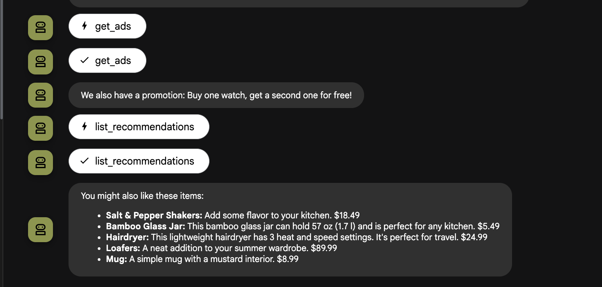
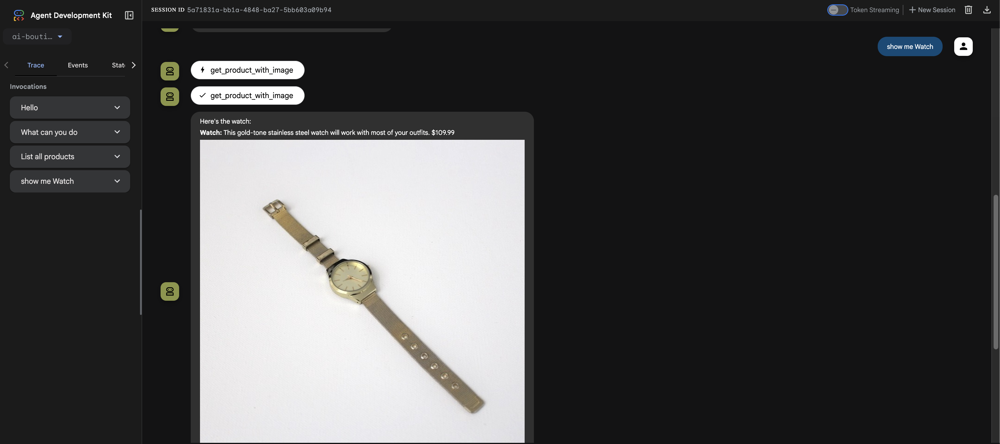

# AI Boutique Assistant MCP Client

An AI shopping assistant built with Google ADK (Agent Development Kit) and Model Context Protocol (MCP) that connects to Online Boutique microservices. Uses the [ai-boutique-assit-mcp](https://pypi.org/project/ai-boutique-assit-mcp/) PyPI package for MCP server functionality.

**Built for the [GKE Turns 10 Hackathon](https://gketurns10.devpost.com/)** - demonstrating how to supercharge existing microservice applications with agentic AI capabilities on Google Kubernetes Engine.








## Table of Contents

1. [Architecture](#1-architecture)
   - [System Architecture Diagram](#system-architecture-diagram)
   - [Key Architecture Components](#key-architecture-components)
   - [MCP Integration](#mcp-integration)

2. [Hackathon Project](#2-hackathon-project)
   - [Challenge Requirements Met](#challenge-requirements-met)
   - [Technologies Used](#technologies-used)

3. [Features](#3-features)
   - [AI Shopping Assistant](#ai-shopping-assistant)
   - [E-commerce Features](#e-commerce-features)
   - [MCP Protocol Features](#mcp-protocol-features)

4. [Product Demo](#4-product-demo)
   - [1. ADK Web Interface](#1-adk-web-interface)
   - [2. Shopping Conversations](#2-shopping-conversations)
   - [3. Product Recommendations](#3-product-recommendations)
   - [4. Visual Product Browsing](#4-visual-product-browsing)

5. [Built With](#5-built-with)
   - [Agent Technologies](#agent-technologies)
   - [MCP Technologies](#mcp-technologies)
   - [Dependencies](#dependencies)

6. [Prerequisites](#6-prerequisites)
   - [For Local Development](#for-local-development)
   - [For GKE Deployment](#for-gke-deployment)

7. [Quick Start](#7-quick-start)
   - [1. Clone and Setup](#1-clone-and-setup)
   - [2. Local Development](#2-local-development)
   - [3. MCP Server Configuration](#3-mcp-server-configuration)

8. [Usage Examples](#8-usage-examples)
   - [Product Search](#product-search)
   - [Shopping Cart](#shopping-cart)
   - [Visual Shopping](#visual-shopping)

9. [MCP Server Integration](#9-mcp-server-integration)
   - [Server Invocation](#server-invocation)
   - [Available MCP Tools](#available-mcp-tools)
   - [Tool Categories](#tool-categories)

10. [Configuration](#10-configuration)
    - [Environment Variables](#environment-variables)
    - [Kubernetes Secrets](#kubernetes-secrets)

11. [Docker Deployment](#11-docker-deployment)
    - [Build and Push](#build-and-push)
    - [Kubernetes Resources](#kubernetes-resources)

12. [GKE Deployment](#12-gke-deployment)
    - [Ingress Setup](#ingress-setup)
    - [Deploy Commands](#deploy-commands)
    - [Access Application](#access-application)

13. [Troubleshooting](#13-troubleshooting)
    - [Common Issues](#common-issues)
    - [Debugging](#debugging)

## 1. Architecture

### System Architecture Diagram

```
┌─────────────────┐    ┌─────────────────┐    ┌─────────────────┐
│   Web Browser   │────│   ADK Web UI    │────│  MCP Protocol   │
└─────────────────┘    └─────────────────┘    └─────────────────┘
                                │                        │
                                │                        │
                         ┌─────────────────┐    ┌─────────────────┐
                         │  ADK Agent      │────│  MCP Server     │
                         │  (Gemini 2.0)   │    │  (ai-boutique-  │
                         └─────────────────┘    │   assit-mcp)    │
                                                └─────────────────┘
                                                         │
                                  ┌──────────────────────┼──────────────────────┐
                                  │                      │                      │
                            ┌─────────────┐    ┌─────────────┐    ┌─────────────┐
                            │   Product   │    │    Cart     │    │ Checkout    │
                            │  Catalog    │    │  Service    │    │  Service    │
                            └─────────────┘    └─────────────┘    └─────────────┘
                                  │                      │                      │
                                  └──────────────────────┼──────────────────────┘
                                           Online Boutique Microservices
```

### Key Architecture Components

**Data Flow:**
1. **User Request** → ADK Web UI → ADK Agent
2. **AI Processing** → Gemini 2.0 Flash → MCP Tool Selection
3. **MCP Communication** → Stdio Protocol → MCP Server
4. **Microservice Calls** → gRPC Client → Online Boutique Services
5. **Response Assembly** → MCP Server → ADK Agent → Web UI

**Communication Patterns:**
- **Web UI ↔ Agent:** ADK Web Server Protocol
- **Agent ↔ MCP Server:** Stdio (stdin/stdout) with JSON-RPC
- **MCP Server ↔ Microservices:** gRPC (Protocol Buffers)
- **Infrastructure:** Kubernetes Service Discovery

### MCP Integration


The agent uses MCP to expose all Online Boutique microservice functions as available tools.

## 2. Hackathon Project

This project was created for the [GKE Turns 10 Hackathon](https://gketurns10.devpost.com/), which challenges developers to "give microservices an AI upgrade" by building agentic AI capabilities on top of existing applications without modifying core application code.

### Challenge Requirements Met

- **Base Application:** Online Boutique microservices demo
- **Platform:** Google Kubernetes Engine (GKE) for deployment
- **AI Models:** Google Gemini 2.0 Flash via ADK
- **External Components:** New containerized AI assistant that interacts with existing APIs
- **No Core Modifications:** Original Online Boutique code remains untouched
- **Agent Framework:** Uses ADK (Agent Development Kit) and MCP (Model Context Protocol) Server and Client

### Technologies Used

**Required:**
- **Google Kubernetes Engine (GKE)** - Container orchestration platform
- **Google AI Models** - Gemini 2.0 Flash for conversational AI

**Recommended (Used):**
- **Agent Development Kit (ADK)** - Agent framework and web interface
- **Model Context Protocol (MCP)** - Communication with microservice APIs

## 3. Features

### AI Shopping Assistant
- **Natural Language Search** - Search products using conversational language
- **Price Filtering** - Filter products by price ranges ("under $50", "cheap items")
- **Product Recommendations** - Get suggestions based on user behavior
- **Visual Shopping** - Product images and visual browsing experience
- **Contextual Ads** - Relevant promotional content

### E-commerce Features
- **Product Catalog** - Browse and search products via gRPC services
- **Shopping Cart** - Add/remove items, view cart contents
- **Checkout Process** - Complete checkout with default payment/shipping
- **Order Confirmation** - Order summary with tracking information
- **Currency Conversion** - International currency support
- **Email Notifications** - Order confirmation emails

### MCP Protocol Features
- **Tool Discovery** - Automatic detection of available microservice functions
- **Type Safety** - Strongly typed function calls via MCP
- **Error Handling** - Graceful error handling across service boundaries
- **Session Management** - Persistent connections to microservices

## 4. Product Demo

Experience the complete user journey through the AI Boutique Assistant:

### 1. ADK Web Interface

The clean, modern ADK web interface provides an intuitive chat experience for shopping.

### 2. Shopping Conversations


Natural language interactions for browsing products, adding to cart, and checkout.

### 3. Product Recommendations



AI-powered "You May Also Like" suggestions based on product relationships and shopping behavior.

### 4. Visual Product Browsing



Rich product displays with images, descriptions, and direct add-to-cart functionality.

## 5. Built With

### Programming Languages
- **Python 3.11** - Primary backend language for ADK agent and MCP integration
- **YAML** - Kubernetes manifests and configuration files
- **Bash** - Deployment and automation scripts
- **Markdown** - Documentation and README

### AI & Agent Frameworks
- **Google Agent Development Kit (ADK) 1.14.1** - Core agent framework for AI orchestration
- **Model Context Protocol (MCP) 1.12.1** - Communication protocol between agent and tools
- **Gemini 2.0 Flash** - Google's latest LLM for natural language processing
- **Google AI Platform APIs** - AI model access and inference

### Communication Protocols
- **gRPC** - High-performance RPC framework for microservice communication
- **Protocol Buffers** - Data serialization and service definition
- **JSON-RPC** - MCP protocol transport layer
- **Stdio Protocol** - ADK to MCP server communication
- **HTTP/HTTPS** - Web interface and API communication

### Container & Orchestration
- **Docker** - Container platform for application packaging
- **Google Kubernetes Engine (GKE)** - Container orchestration platform
- **Kubernetes** - Container orchestration and service discovery
- **kubectl** - Kubernetes command-line tool

### Cloud Services
- **Google Cloud Platform (GCP)** - Primary cloud provider
- **Google Container Registry (GCR)** - Container image storage
- **Google Cloud APIs** - Platform services integration
- **Kubernetes Engine API** - Cluster management

### Web & Application Servers
- **ADK Web Server** - Built-in agent web interface
- **Uvicorn** - ASGI server for Python applications
- **FastAPI** - Modern Python web framework (via ADK)

### Networking & Ingress
- **Nginx Ingress Controller** - HTTP(S) load balancing and routing
- **Kubernetes Services** - Internal service discovery and load balancing
- **Kubernetes Ingress** - External HTTP(S) access management
- **LoadBalancer Services** - External IP assignment

### Microservices (Online Boutique)
- **Product Catalog Service** - Product search and catalog management
- **Cart Service** - Shopping cart operations
- **Recommendation Service** - AI-powered product suggestions
- **Shipping Service** - Shipping quotes and order fulfillment
- **Currency Service** - Multi-currency support and conversion
- **Payment Service** - Payment processing and validation
- **Email Service** - Order confirmation and notifications
- **Checkout Service** - Complete order processing workflow
- **Ad Service** - Contextual advertising and promotions

### Development Tools
- **Git** - Version control system
- **GitHub** - Code repository and collaboration
- **PyPI** - Python package distribution (ai-boutique-assit-mcp)
- **pip** - Python package manager

### Package Dependencies
- **google-adk==1.14.1** - Google Agent Development Kit
- **ai-boutique-assit-mcp==1.0.4** - Custom MCP server package
- **grpcio** - gRPC Python library
- **protobuf** - Protocol Buffers Python support
- **requests** - HTTP client library
- **uvicorn** - ASGI server implementation

## 6. Prerequisites

### For Local Development
- **Python 3.11+**
- **Google Cloud CLI (gcloud)**
- **kubectl** (for microservices access)
- **Google API Key** for Gemini access

### For GKE Deployment
- **Docker Desktop**
- **kubectl** configured for your GKE cluster
- **GKE cluster** with Online Boutique services running

## 7. Quick Start

### 1. Clone and Setup

```bash
git clone https://github.com/arjunprabhulal/ai-boutique-assit-mcp-client.git
cd ai-boutique-assit-mcp-client

# Install dependencies
pip install -r requirements.txt
```

### 2. Local Development

```bash
# Set your Google API key
export GOOGLE_API_KEY="your-google-api-key"

# Run the agent locally
adk run ai-boutique-assit

# Or run with web interface
adk web ai-boutique-assit --host 0.0.0.0 --port 8000
```

### 3. MCP Server Configuration

The MCP server is automatically invoked by the ADK agent:

```python
McpToolset(
    connection_params=StdioConnectionParams(
        server_params=StdioServerParameters(
            command="boutique-mcp-server",
            args=["--stdio"]
        ),
        timeout=180
    )
)
```

## 8. Usage Examples

### Product Search
```
"Show me trending products"
→ AI calls list_products MCP tool
→ Displays product gallery with images and pricing
→ Includes contextual advertisements and recommendations
```

### Shopping Cart
```
"Add 2 coffee mugs to my cart"
→ AI searches for "coffee mugs" via search_products tool
→ Calls add_item_to_cart with product ID and quantity
→ Shows updated cart with get_cart tool
```

### Visual Shopping
```
"Show me images of sunglasses"
→ AI calls get_product_with_image tool
→ Downloads and displays product images
→ Shows product details with add-to-cart options
```

## 9. MCP Server Integration

### Server Invocation

When the agent starts, it automatically:
1. Executes `boutique-mcp-server --stdio` as a subprocess 
2. Connects via stdio (stdin/stdout communication)
3. The MCP server loads all microservice gRPC clients and functions
4. Functions are exposed as MCP tools available to the agent
5. User requests trigger MCP tool calls to microservices

The `boutique-mcp-server` command is provided by the [ai-boutique-assit-mcp](https://pypi.org/project/ai-boutique-assit-mcp/) package installation.

### Available MCP Tools

The MCP server exposes these microservice functions:

### Tool Categories

**Product Catalog Tools:**
- `list_products` - List all available products
- `search_products` - Search products by keyword
- `get_product` - Get specific product details
- `get_product_with_image` - Get product with image download
- `filter_products_by_price` - Filter products by price range

**Shopping Cart Tools:**
- `add_item_to_cart` - Add items to user cart
- `get_cart` - Retrieve cart contents
- `empty_cart` - Clear cart contents

**Order Processing Tools:**
- `place_order` - Process complete order
- `initiate_checkout` - Start checkout process

**Additional Service Tools:**
- `list_recommendations` - Get product recommendations
- `get_ads` - Retrieve contextual advertisements
- `get_shipping_quote` - Get shipping estimates
- `ship_order` - Process shipping
- `charge_card` - Process payments
- `convert_currency` - Currency conversion
- `send_order_confirmation` - Send confirmation emails

## 10. Configuration

### Environment Variables

The AI assistant connects to these microservices:

| Service | Default Port | Environment Variable |
|---------|--------------|---------------------|
| Product Catalog | 3550 | `PRODUCT_CATALOG_SERVICE` |
| Cart Service | 7070 | `CART_SERVICE` |
| Recommendation | 8080 | `RECOMMENDATION_SERVICE` |
| Shipping | 50051 | `SHIPPING_SERVICE` |
| Currency | 7000 | `CURRENCY_SERVICE` |
| Payment | 50051 | `PAYMENT_SERVICE` |
| Email | 5000 | `EMAIL_SERVICE` |
| Checkout | 5050 | `CHECKOUT_SERVICE` |
| Ad Service | 9555 | `AD_SERVICE` |

### Kubernetes Secrets

Create the required secret for Google API access:

```bash
kubectl create secret generic google-api-key \
  --from-literal=api-key="your-google-api-key"
```

## 11. Docker Deployment

### Build and Push

```bash
# Build for AMD64 (GKE compatibility)
docker build --platform linux/amd64 -t gcr.io/$PROJECT_ID/ai-boutique-assistant:latest .

# Push to Google Container Registry
docker push gcr.io/$PROJECT_ID/ai-boutique-assistant:latest
```

### Kubernetes Resources

- **Deployment:** `ai-boutique-mcp`
- **Service:** `ai-boutique-mcp-service` (ClusterIP on port 8000)
- **Ingress:** `ai-boutique-mcp-ingress` (uses `ingress-nginx-mcp` class)

## 12. GKE Deployment

### Ingress Setup

The deployment uses a dedicated ingress controller to avoid conflicts:

```bash
# Install separate nginx controller
kubectl apply -f ingress-nginx-mcp-clean.yaml

# Wait for controller to be ready
kubectl wait --namespace ingress-nginx-mcp \
  --for=condition=ready pod \
  --selector=app.kubernetes.io/component=controller \
  --timeout=120s

# Get external IP
kubectl get service ingress-nginx-mcp-controller -n ingress-nginx-mcp
```

### Deploy Commands

**Quick Deploy:**
```bash
export PROJECT_ID="your-gcp-project-id"
./deploy.sh
```

**Manual Deploy:**
```bash
# Build and push
docker build --platform linux/amd64 -t gcr.io/$PROJECT_ID/ai-boutique-assistant:$(date +%s) .
docker push gcr.io/$PROJECT_ID/ai-boutique-assistant:$(date +%s)

# Deploy to Kubernetes
kubectl apply -f k8s/deployment.yaml
kubectl apply -f k8s/service.yaml
kubectl apply -f k8s/ingress.yaml
```

### Access Application

Once deployed, access your AI assistant at:
```
http://[EXTERNAL-IP]/
```

Get the external IP:
```bash
kubectl get ingress ai-boutique-mcp-ingress
```

## 13. Troubleshooting

### Common Issues

**MCP Connection Errors**
```bash
# Check if MCP server package is installed
pip show ai-boutique-assit-mcp

# Verify stdio mode configuration
kubectl logs -l app=ai-boutique-mcp
```

**Bad Gateway (502)**
```bash
# Check pod status
kubectl get pods -l app=ai-boutique-mcp

# Verify service endpoints
kubectl describe service ai-boutique-mcp-service
```

**Ingress Not Working**
```bash
# Check ingress controller
kubectl get pods -n ingress-nginx-mcp

# Verify ingress configuration
kubectl describe ingress ai-boutique-mcp-ingress
```

**Port Conflicts**
```bash
# Kill conflicting processes
pkill -f "kubectl.*port-forward"
lsof -ti:8000 | xargs kill -9
```

### Debugging

```bash
# Application logs
kubectl logs -l app=ai-boutique-mcp -f

# Ingress controller logs
kubectl logs -n ingress-nginx-mcp -l app.kubernetes.io/component=controller

# Check microservice connectivity
kubectl exec -it deployment/ai-boutique-mcp -- curl http://productcatalogservice:3550
```

## Additional Resources

### Hackathon
- [GKE Turns 10 Hackathon](https://gketurns10.devpost.com/) - The hackathon this project was built for

### Project Components
- [AI Boutique MCP Client](https://github.com/arjunprabhulal/ai-boutique-assit-mcp-client) - This repository
- [AI Boutique MCP Server (PyPI)](https://pypi.org/project/ai-boutique-assit-mcp/) - MCP server package
- [AI Boutique MCP Server (GitHub)](https://github.com/arjunprabhulal/ai-boutique-assit-mcp) - MCP PyPI package

### References
- [Google Agent Development Kit](https://github.com/googleapis/agent-development-kit)
- [Model Context Protocol](https://github.com/modelcontextprotocol/python-sdk)
- [Online Boutique Demo](https://github.com/GoogleCloudPlatform/microservices-demo)
- [Kubernetes Ingress](https://kubernetes.io/docs/concepts/services-networking/ingress/)

## Testing Instructions

### Prerequisites for Testing

#### Required Setup
- **Google API Key** for Gemini 2.0 Flash access
- **Python 3.11+** installed locally
- **Docker Desktop** running (for containerized testing)
- **kubectl** configured (for GKE testing)

#### Environment Setup
```bash
# Clone the repository
git clone https://github.com/arjunprabhulal/ai-boutique-assit-mcp-client.git
cd ai-boutique-assit-mcp-client

# Install dependencies
pip install -r requirements.txt

# Set your Google API key
export GOOGLE_API_KEY="your-google-api-key"
```

### Local Testing

#### 1. Test MCP Server Installation
```bash
# Verify MCP server package is installed
pip show ai-boutique-assit-mcp

# Test MCP server can start
boutique-mcp-server --help
```

**Expected Output:**
```
usage: boutique-mcp-server [-h] [--port PORT] [--stdio] [--http]
AI Boutique Assistant MCP Server
```

#### 2. Test ADK Agent Locally
```bash
# Start the ADK agent
adk run ai-boutique-assit
```

**Expected Behavior:**
- Agent starts with "Running agent botiq_ai_assist"
- MCP server automatically spawns in stdio mode
- Agent responds to "hi" with greeting
- Type "exit" to stop

#### 3. Test ADK Web Interface
```bash
# Start web interface
adk web ai-boutique-assit --host 0.0.0.0 --port 8000
```

**Expected Behavior:**
- Web server starts on http://localhost:8000
- Browser shows ADK web chat interface
- Can interact with AI shopping assistant

### Feature Testing

#### Shopping Features Test Cases

**1. Product Search**
- **Input:** "Show me trending products"
- **Expected:** Agent calls `list_products` MCP tool, returns product list with names, prices, descriptions

**2. Price Filtering**
- **Input:** "Find products under $50"
- **Expected:** Agent calls `filter_products_by_price` MCP tool, returns only products under $50

**3. Add to Cart**
- **Input:** "Add 2 mugs to my cart"
- **Expected:** Agent searches for "mugs" first, calls `add_item_to_cart` with product ID and quantity

**4. View Cart**
- **Input:** "Show my cart"
- **Expected:** Agent calls `get_cart` MCP tool, returns cart items with product details

**5. Visual Shopping**
- **Input:** "Show me images of sunglasses"
- **Expected:** Agent calls `get_product_with_image` MCP tool, downloads and displays product images

**6. Checkout Process**
- **Input:** "I want to checkout"
- **Expected:** Agent uses default shipping/payment details, calls `place_order` MCP tool

### Integration Testing Scenarios

#### Complete Shopping Flow Test
1. **Start conversation:** "Hi, I want to shop"
2. **Browse products:** "Show me trending products"
3. **Search specific:** "Find coffee mugs"
4. **Add to cart:** "Add 2 mugs to my cart"
5. **View cart:** "What's in my cart?"
6. **Get recommendations:** Should auto-show related products
7. **Checkout:** "I want to checkout"
8. **Confirm order:** Verify order details and tracking

### Docker Testing

#### 1. Test Docker Build
```bash
# Build container
docker build --platform linux/amd64 -t ai-boutique-assistant:test .

# Test container locally
docker run -e GOOGLE_API_KEY="your-key" -p 8000:8000 ai-boutique-assistant:test
```

#### 2. Test Container Health
```bash
# Check container health
docker ps
docker logs <container-id>
```

### GKE Deployment Testing

#### 1. Test Application Deployment
```bash
# Deploy application
export PROJECT_ID="your-project-id"
./deploy.sh

# Check deployment status
kubectl get pods -l app=ai-boutique-mcp
kubectl get service ai-boutique-mcp-service
kubectl get ingress ai-boutique-mcp-ingress
```

#### 2. Test External Access
```bash
# Get external IP
EXTERNAL_IP=$(kubectl get ingress ai-boutique-mcp-ingress -o jsonpath='{.status.loadBalancer.ingress[0].ip}')
echo "Testing: http://$EXTERNAL_IP/"

# Test connectivity
curl -I http://$EXTERNAL_IP/
```

### Test Validation Checklist

#### Basic Functionality
- [ ] ADK agent starts without errors
- [ ] MCP server connects successfully
- [ ] Web interface accessible
- [ ] Can send/receive messages

#### Shopping Features
- [ ] Product search returns results
- [ ] Price filtering works correctly
- [ ] Add to cart functions properly
- [ ] Cart view shows items correctly
- [ ] Recommendations appear
- [ ] Checkout process completes
- [ ] Order confirmation displays

#### Technical Integration
- [ ] All 18+ MCP tools available
- [ ] gRPC connections to all 9 microservices
- [ ] No connection timeouts
- [ ] Proper error handling

### Known Test Data

The application uses test data for demonstrations:

#### Test User
- **User ID:** "arjun"
- **Email:** "customer@boutique.com"

#### Test Payment (Demo Only)
- **Credit Card:** "4432-8015-6152-0454"
- **CVV:** 672
- **Expiration:** 01/2030

#### Test Shipping (Demo Only)
- **Address:** "1600 Amphitheatre Parkway, Mountain View, CA 94043"

**Note:** All payment and personal data is for testing purposes only and not processed by real payment systems.

## Author

**Arjun Prabhulal**
- Medium: [https://medium.com/@arjun-prabhulal](https://medium.com/@arjun-prabhulal)
- GitHub: [https://github.com/arjunprabhulal](https://github.com/arjunprabhulal)

## Contributing

1. Fork the repository
2. Create a feature branch
3. Make your changes
4. Test locally and on GKE
5. Submit a pull request

## License

MIT License - see LICENSE file for details.